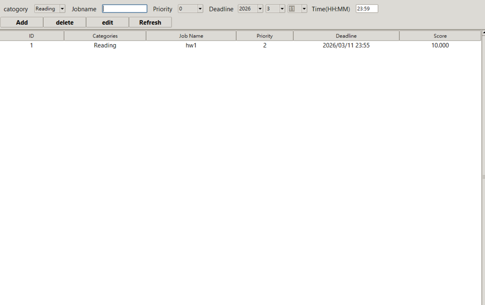
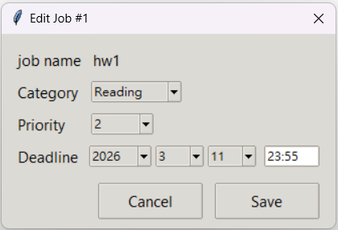

# job_manager

This is a lightweight job manager
#Features:
    -Add/delete/edit jobs
    -lazy deletion
    -job score computation based on deadline and job priority
    -custom job scheduling(Not done)
    -multiple heap-based data structures
    -snapshot and journal persistence
    -simple Tlinter Gui

#Architecture:
    The system is divided into several components:
    JOB_MANAGER/
        |
        |- main.py
        |
        | Backend_component/
        |   |- backend_manager.py
        |   |- jobs.py
        |   |- load_unit.py
        |   |- store_unit.py
        |
        |- UI_component/
        |   |- frontend_manager.py
        |   |- UI_input.py
        |   |- UI_output.py
        |
        |- Time_component/
            |- time_manager.py

